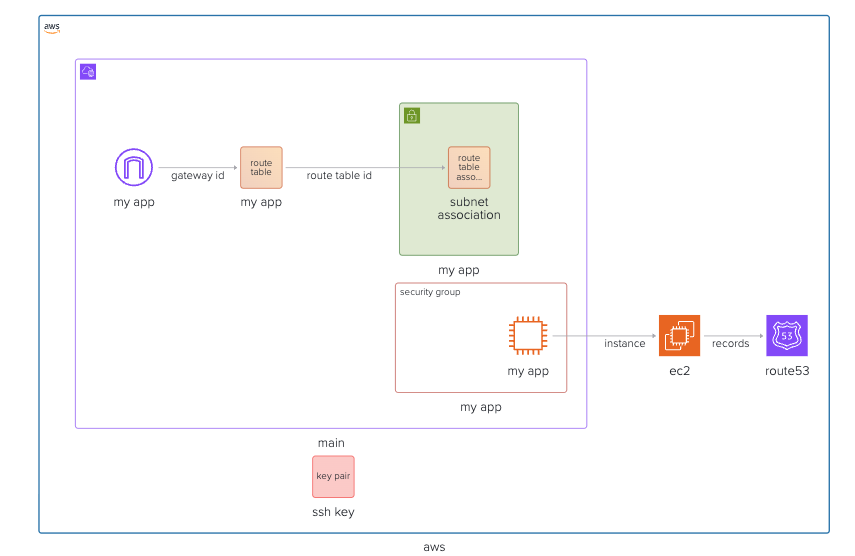

In the previous notes we talked about how to setup the ec2 instance inside of the VPC on the subnet. We managed to access to this instance via SSH by providing ssh key in security groups. If you haven't read about it, fear not, you can still go back and read it: [Deploying EC2 instance on AWS with Terraform](./provisioning-ec2-on-aws-with-terraform).

All is fine and dandy until now, but when we want to run a real application, we want to expose it on HTTP (and later HTTPS). In this note, I will walk you through how to do it using terraform. In practice, we will spawn a simple http server on our ec2 instance, and provide `Route53` DNS records (diagram below).



When adding DNS, we will be able to access our application not via IP address like

```bash
http://52.206.93.210/
```

but via actual domain that you own like

```bash
http://www.your-domain.com
```

Let's dive in!

## Github Repository

This guide full code is available in https://github.com/vvasylkovskyi/ship-infra-project/tree/main/v2-ec2-http. Feel free to clone it and follow along!

## Spawn HTTP server on ec2 instance

in your `ec2.tf` add the following:

```tf
resource "aws_instance" "app" {
  ... your instance previous code ...
  user_data = <<-EOF
              #!/bin/bash
              sudo yum update -y || sudo apt-get update -y
              sudo yum install -y python3 || sudo apt-get install -y python3
              echo "<html><body><h1>Hello from Terraform EC2!</h1></body></html>" > index.html
              nohup python3 -m http.server 80 &
              EOF
}
```

In `outputs.tf` ensure you have the following:

```tf
output "ec2_ip_address" {
  value       = aws_eip.my_app.public_ip
  description = "The Elastic IP address allocated to the EC2 instance."
}
```

The `user_data` is a cool utility in aws that allows us to bake in ec2 some bootstrap code. In this example we start a server using python that is a simple `<html><body><h1>Hello from Terraform EC2!</h1></body></html>` static page.

### Add HTTP rule to security group

In `security-groups.tf` ensure that you have the following rule to allow HTTP access:

```tf
resource "aws_security_group" "my_app" {
  vpc_id = aws_vpc.main.id
  # ... other rules ...
  ingress {
    cidr_blocks = [
      "0.0.0.0/0"
    ]
    from_port = 80
    to_port   = 80
    protocol  = "tcp"
  }
  # ... other rules ...
}
```

### Testing the setup

Run `terraform apply --auto-approve`.

See the output:

```bash
ec2_ip_address = "3.214.79.152" # example output
```

Navigate to `ec2_ip_address` and see website opening


## Adding Route53 records

Next step, to create DNS records we actually have to create a hosted zone first.

## Prerequisite: Domain name

Before we proceed, ensure that you have a domain name registered. You can use any domain registrar of your choice (e.g., GoDaddy, Namecheap, Cloudflare, etc.). For this example, we'll use `your-domain.com`. Replace it with your actual domain name in the Terraform code.

Run `terraform apply --auto-approve` and navigate to [Route 53 Hosted Zones](https://us-east-1.console.aws.amazon.com/route53/v2/hostedzones) and confirm that your hosted zone was created.

### Adding Route53 records

Lets begin our `route53.tf`

```tf
# route53.tf
resource "aws_route53_zone" "main" {
  name = "your-domain.com"
}
```

### Updating DNS Registrar

At this point, there is a manual step where we actually have to go to the web and click our way through. We need to ensure that our DNS registrar has namespaces of our hosted zone from route 53. You may be familiar with the process of updating NS records in your registrar.

You may have purchased your domain from a registrar providers, in my case it is happens to be AWS. But there are many (e.g., GoDaddy, Namecheap, Cloudflare, etc.). So I leave you figure out how to find your DNS management in the registrar. Once you get there, next step is update the `NS` records to the ones that you have just created with the terraform in AWS.

### Update DNS NameSpace records in your DNS registrar

The new Route53 zone that we created using terraform above can be found in the [Hosted Zones](https://us-east-1.console.aws.amazon.com/route53/v2/hostedzones#). Open the zone and find the `NS` records.

Next step is to copy those `NS` records and add them one by one into DNS registrar of your choice (e.g. Cloudflare). These `NS` records essentially are addresses that will know how to find that DNS records of Route53.


The general flow is:

1. The user navigates to `www.your-domain.com`
2. The `your-domain.com` registrar checks its `NS` records to find out where to look for DNS records.
3. The registrar finds the `NS` records that point to Route53.
4. The registrar queries Route53 for the DNS records of `www.your-domain.com`.
5. Route53 responds with the IP address associated with `www.your-domain.com`.

Therefore, it is a crucial step to update the `NS` records in your DNS registrar to point to the Route53 (AWS) name servers.

### Add new DNS record

Once this is done we can proceed and add new DNS record using terraform:

```tf
# route53.tf
resource "aws_route53_zone" "main" {
  name = "your-domain.com"
}

resource "aws_route53_record" "www" {
  zone_id = aws_route53_zone.main.zone_id
  name    = "www.your-domain.com"
  type    = "A"
  ttl     = 60
  records = [aws_eip.my_app.public_ip]
}
```

Above we are creating a DNS record of type `A` which is a type that assigns DNS name to Ipv4 IP address. Note that in this example we are using `EIP` which are fixed IP, to avoid the issues with dynamic IP addresses. This way we make sure that even if the EC2 instance is restarted, and receives new private IP, we still keep same fixed public IP. Lets apply and test `terraform apply --auto-approve`.

**Note**, check if the name servers got applied. Sometimes it takes a while for your changes to take effect. You can check by running:

```bash
dig +short NS your-domain.com
```

In the output, you should see the name servers that you have added in your DNS registrar. If they are not correct, wait a bit longer, you should receive the following error in browser `DNS_PROBE_FINISHED_NXDOMAIN` which indicates that the DNS records are not yet propagated.

Once they are correct, your DNS should be applied. Visit `http://www.your-domain.com` and see it showing our demo app!

## Destroying Infra

Remember, infra has costs. When you are done experimenting, you can destroy the infra like follows:

```bash
terraform destroy --auto-approve
```

## Conclusion

And that is a wrap! Now we have the DNS records pointing to our Ec2 instance. Next, let's explore about how to add SSL to this domain and enable HTTPS. But before that, let's organize our code a little. Continue reading!
