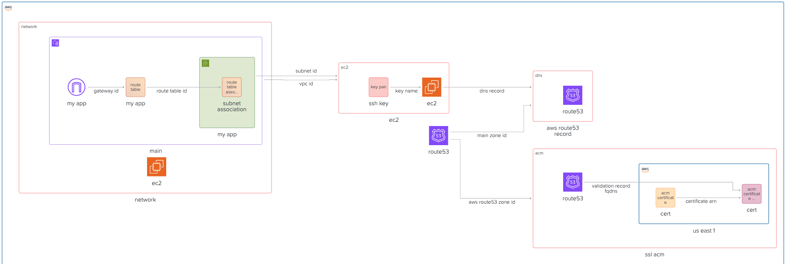

To enable SSL termination in AWS, you first need to provision an SSL certificate using AWS Certificate Manager (ACM). This certificate will be used by services like API Gateway or Application Load Balancer to encrypt traffic between your users and your application.

In this guide, we will walk through the steps to request and validate an SSL certificate using Terraform. Then the certificate can be provisioned as a terraform module, and we will show how to use it in the next guides:



## Github Repository

This guide full code is available in https://github.com/vvasylkovskyi/ship-infra-project/tree/main/v4-acm-ssl. Feel free to clone it and follow along!

## Provision SSL Certificate

let's create an ACM resource. We will do that in new module: `modules/acm`

```tf
# modules/acm/main.tf
provider "aws" {
  alias  = "us_east_1"
  region = "us-east-1"
  shared_credentials_files = ["./.aws-credentials"]
  profile                  = "terraform"
}

resource "aws_acm_certificate" "cert" {
  provider                  = aws.us_east_1
  domain_name               = "your-domain.com"
  validation_method         = "DNS"
  subject_alternative_names = ["www.your-domain.com", "your-domain.com"]
  lifecycle {
    create_before_destroy = true
  }
}
```

Note, that ACM certificates for API Gateway must be created in `us-east-1` region, regardless of where your API Gateway is located. Hence, we define a separate AWS provider with alias `us_east_1` to handle this.

The code above requests an SSL/TLS certificate from AWS Certificate Manager for your domain. We choose DNS validation (simplest in Terraform if using Route 53).Note that we are adding `lifecycle.create_before_destroy`. This is because in case you change something on this resource, since Application Load Balancer will be using the certificate, this directive allows to duplicate certificate, and replace old one before destroying it thus allowing application load balancer to switch certificates without issues.

### DNS Validation via Route 53

Next, we need to create the required DNS record to prove domain ownership to ACM.

```tf
# modules/acm/main.tf
resource "aws_route53_record" "cert_validation" {
  for_each = {
    for dvo in aws_acm_certificate.cert.domain_validation_options : dvo.domain_name => {
      name  = dvo.resource_record_name
      type  = dvo.resource_record_type
      value = dvo.resource_record_value
    }
  }
  name    = each.value.name
  type    = each.value.type
  zone_id = var.aws_route53_zone_id
  records = [each.value.value]
  ttl     = 60
}
```

In the code above, the `for_each` turns the set into a map indexed by `domain_name` (which is unique). We are dynamically generating multiple DNS records (1 per domain to validate) using `for_each`. `aws_acm_certificate.cert.domain_validation_options` is a list of instructions from AWS on how to validate your domain. We loop over each `dvo` (domain validation option), and create a map like:

```tf
{
  "www.your-domain.com" = {
    name  = "_xyz.www.your-domain.com."
    type  = "CNAME"
    value = "_abc.acm-validations.aws."
  }
}
```

This is how AWS verifies domain ownership: you create a DNS record with those values. The

```tf
  records = [each.value.value]
  ttl     = 60
```

- `records`: The actual value to put in the DNS record (like \_abc.acm-validations.aws.)
- `ttl`: Time-to-live (how long DNS resolvers cache it), set to 60 seconds for fast propagation.

Next, we are adding a resource that tells AWS to wait for validation to complete before proceeding. It depends on the DNS record being correct.

```tf
# modules/acm/main.tf
resource "aws_acm_certificate_validation" "cert" {
  provider        = aws.us_east_1
  certificate_arn = aws_acm_certificate.cert.arn
  validation_record_fqdns = [
    for record in aws_route53_record.cert_validation : record.fqdn
  ]
}
```

Let's also output the certificate ARN for later use:

```tf
# modules/acm/outputs.tf
output "aws_acm_certificate_arn" {
  value = aws_acm_certificate.cert.arn
}

output "aws_acm_certificate_cert" {
  value = aws_acm_certificate.cert
}
```

Add this module to your main terraform file:

```tf
# main.tf
module "ssl_acm" {
  source              = "./modules/acm"
  aws_route53_zone_id = aws_route53_zone.main.zone_id
}
```

And now we have ACM certificate ready to be used in API Gateway. Let's ensure everything is correct by running:

```sh
terraform init
terraform apply --auto-approve
```

## Destroying Infra

Remember, infra has costs. When you are done experimenting, you can destroy the infra like follows:

```bash
terraform destroy --auto-approve
```

## Next Steps

With the SSL certificate provisioned, you can now integrate it with your AWS services. In the next guides, we will demonstrate how to use this certificate with API Gateway and Application Load Balancer for SSL termination. Feel free to skip to the relevant section based on your architecture needs.
