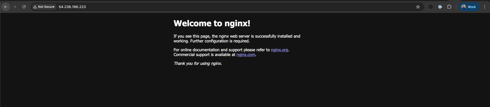

In this notes we will continue improving on our infrastructure by adding HTTPS to our web app.

Due to extra complexity in requirements of setting up the ALB, our network topology will suffer some changes. For example, a load balancer requires two availability zones to run in AWS. This means extra configuration overhead which we will have to work with.

As a bonus, since we will have multiple availability zones, we are going to showcase in the end of this guide how to make ALB work with 2 EC-2 instances. And you could scale to as much instances as you want!

## Prerequisites

Make sure you have the setup from the previous guides - [Provisioning EC-2 instance with Terraform](../core-web-app/provisioning-ec2-on-aws-with-terraform) and [Provisioning SSL Certificate](./provision-ssl-certificate).

## Architecture Overview


We will do the following:

- Modify Network so that we have two subnets in two availability zones. This is required for load balancer to work.
- Provision SSL certificate using ACM, for load balancer
- Provision Load Balancer itself, and make it proxy requests to the EC-2 instances
- Update Route53 to point our DNS to the Load Balancer
- Update Ec-2 to serve slightly different app for demonstration purposes

## Github Repository

This guide full code is available in https://github.com/Ship-Infra/ship-infra-project/tree/main/v6-ssl-load-balancer. Feel free to clone it and follow along!

## Modify Network module to have multiple availability zones

In the `modules/network`, change the `main.tf` to include multiple availability zones:

For simplicity, we will define only two public subnets, without private subnets.

#### List Availability Zones

First, we will define a resource listing availability zones.

```hcl
# modules/network/main.tf
resource "aws_vpc" "main" {
  cidr_block           = var.vpc_cidr
  enable_dns_hostnames = true
  enable_dns_support   = true
}

data "aws_availability_zones" "available" {}
```

This resource returns a list of all AZ available in the region configured in the AWS credentials.

#### Add two public subnets

We will be using the terraform `count` directive. `count` is used as a loop, so we can define some resource multiple times. Since we only need two public subnets, naturaly the `count=2`. Let's write two public subnets:

```hcl
# modules/network/main.tf

resource "aws_subnet" "public" {
  count                   = 2
  cidr_block              = cidrsubnet(aws_vpc.main.cidr_block, 4, 2 + count.index)
  availability_zone       = data.aws_availability_zones.available.names[count.index]
  vpc_id                  = aws_vpc.main.id
  map_public_ip_on_launch = true
}
```

We are referencing the `data.aws_availability_zones.available.names` defined about to choose an availability name in our `vpc`. Besides that, we need the route table to define how network traffic is directed within our VPC (i.e., after internet gateway).

```hcl
# modules/network/main.tf
resource "aws_internet_gateway" "my_app" {
  vpc_id = aws_vpc.main.id
}

resource "aws_route_table" "public" {
  vpc_id = aws_vpc.main.id

  route {
    cidr_block = "0.0.0.0/0"
    gateway_id = aws_internet_gateway.my_app.id
  }
}
```

The above code will create a route table for our VPC. The `route` says that all the outbound traffic `0.0.0.0/0` will be directed to the internet via the VPC's Internet Gateway. This piece of code essentially makes our subnet using this route table _public_. Now this route table is attached to our VPC, but not to subnet. To attach it to our two subnets, we need to create an association between subnets and this route table:

```hcl
# modules/network/main.tf

resource "aws_route_table_association" "public" {
  count          = 2
  subnet_id      = aws_subnet.public[count.index].id
  route_table_id = aws_route_table.public.id
}
```

Finally, we will make our route table a main one, just to leave explicit association.

```hcl
# modules/network/main.tf

resource "aws_main_route_table_association" "public_main" {
  vpc_id         = aws_vpc.main.id
  route_table_id = aws_route_table.public.id
}
```

Let's expose the public subnet IDs as output:

```hcl
# modules/network/outputs.tf
output "vpc_id" { value = aws_vpc.main.id }
output "public_subnet_ids" {
  value = aws_subnet.public[*].id
}
```

## Provision SSL Certificate

Let's create an ACM resource. You can follow the previous guide on [Provisioning SSL Certificate](./provision-ssl-certificate) to provision the SSL certificate using ACM. Ensure that you have the certificate ARN available for use in the API Gateway module.

## Provisioning AWS Load Balancer

Now that we have network and SSL certificate, we can start provisioning load balancer itself.

### Creating ALB

First, let's create ALB resource:

```hcl
# modules/alb/main.tf

resource "aws_lb" "my_app" {
  name               = "my-app-alb"
  internal           = false
  load_balancer_type = "application"
  security_groups    = [aws_security_group.my_alb.id]
  subnets            = var.subnets
}
```

Load balancer will to be inserted in front of our public subnets (hence the `internal=false`), i.e, the subnets that we have just created. The `load_balancer_type=application` is the typical for most web applications. Alternatives are `network` and `gateway`.

The security group for ALB needs to allow igress for 443 (SSL) and egress for everything is fine for now.

```tf
# modules/alb/main.tf

resource "aws_security_group" "my_alb" {
  name   = "Security Group for Application Load Balancer"
  vpc_id = var.vpc_id

  ingress {
    cidr_blocks = ["0.0.0.0/0"]
    from_port   = 443
    to_port     = 443
    protocol    = "tcp"
  }

  egress {
    from_port   = 0
    to_port     = 0
    protocol    = "-1"
    cidr_blocks = ["0.0.0.0/0"]
  }
}
```

Note we are passing multiple `subnets` created in the network module above. Let's define them as variable:

```hcl
# modules/alb/variables.tf
variable "subnets" { type = list(string) }
variable "vpc_id" { type = string }
```

### Provision ALB Target Group and ALB Listener

The ALB Listener and ALB Target Group are input and output rules of ALB. We will define that ALB accepts requests at port 443 and use `certificate_arn` our SSL certificate. The only action ALB will do is HTTPS termination and then a simple forward to the ALB Target group - our cluster.

**Begin with defining ALB Listener:**

```hcl
# modules/alb/main.tf

resource "aws_lb_listener" "https" {
  load_balancer_arn = aws_lb.my_app.arn
  port              = 443
  protocol          = "HTTPS"
  ssl_policy        = "ELBSecurityPolicy-2016-08"
  certificate_arn   = var.acm_certificate_cert_arn

  default_action {
    type             = "forward"
    target_group_arn = aws_lb_target_group.my_app.arn
  }

  depends_on = [var.acm_certificate_cert]
}
```

And now, we have to define our target group: `target_group_arn`.

**Defining our Target Group:**

```hcl
# modules/alb/main.tf

resource "aws_lb_target_group" "my_app" {
  name     = "my-app-tg"
  port     = 80
  protocol = "HTTP"
  vpc_id   = var.vpc_id

  health_check {
    path                = "/"
    protocol            = "HTTP"
    matcher             = "200-399"
    interval            = 30
    timeout             = 15
    healthy_threshold   = 2
    unhealthy_threshold = 5
  }

  depends_on = [aws_lb.my_app]
}
```

From our load balancer we will forward requests into our cluster, which contains Ec-2 instances listening on port 80. Since we are in our subnet, it is safe to use HTTP. The `health_check` block defines which URL the ALB uses to decide if the target containers are healthy. Here we define the base URL since this is our simples python server application. You can read more information about [health checks on AWS docs](https://docs.aws.amazon.com/elasticloadbalancing/latest/application/target-group-health-checks.html). `healthy_threshold` and `unhealthy_threshold` define how many (failed) healthchecks a target should be evaluated as healthy or unhealthy. These healthchecks are performed in intervals of seconds defined in interval.

Let's not forget to define the additional variables in `variables.tf`:

```hcl
# modules/alb/variables.tf
variable "subnets" { type = list(string) }
variable "vpc_id" { type = string }
variable "acm_certificate_cert_arn" { type = string }
variable "acm_certificate_cert" {
  type = object({
    arn = string
    id  = string
  })
}
```

### Attach EC-2 to the Target Group

For Load Balancer to forward requests to the EC-2, we need to attach it to the target group. This is done using `aws_lb_target_group_attachment` resource:

```hcl
resource "aws_lb_target_group_attachment" "ec2_attachment" {
  target_group_arn = aws_lb_target_group.my_app.arn
  target_id        = var.ec2_first_instance_id
  port             = 80
}
```

Note port 80 is the HTTP but it is fine, since we already checked for SSL at the load balancer listener.

Let's add a variable for `ec2_first_instance_id`:

```hcl
# modules/alb/variables.tf
variable "ec2_first_instance_id" { type = string }
```

Note, we have called it `ec2_first_instance_id` because we will be adding more EC-2 instances later. Let's ensure setup works with one instance first... Oh well! It is not that hard. Let's prepare out load balancer to accept array of ec2 instances already

**Variables**

```hcl
# modules/alb/variables.tf
variable "ec2_instance_ids" { type = list(string) }
```

**Attachment Resource**

```hcl
# modules/alb/main.tf
resource "aws_lb_target_group_attachment" "ec2_attachment" {
  count = length(var.ec2_instance_ids)

  target_group_arn = aws_lb_target_group.my_app.arn
  target_id        = var.ec2_instance_ids[count.index]
  port             = 80
}
```

Note we are using the `count` directive to loop over all the EC-2 instance IDs passed in the variable `ec2_instance_ids`.

**Outputs**

And lets expose the DNS name and zone ID of the load balancer for later use in Route53:

```hcl
# modules/alb/outputs.tf
output "dns_name" {
    value = aws_lb.my_app.dns_name
}

output "zone_id" {
    value = aws_lb.my_app.zone_id
}
```

## Update Route53 to Point to ALB

We have HTTPS on our ALB, now we have to make DNS point to ALB.

```hcl
# modules/dns/main.tf

resource "aws_route53_record" "record" {
  zone_id = data.aws_route53_zone.main.zone_id
  name    = var.domain_name
  type    = "A"

  alias {
    name                   = var.aws_dns_name
    zone_id                = var.aws_zone_id
    evaluate_target_health = true
  }
}
```

and Outputs:

```hcl
# modules/dns/outputs.tf
output "www_dns_record" {
  value       = aws_route53_record.www.fqdn
  description = "The FQDN of the www Route53 record"
}
```

## Update Ec-2 to use the subnets from the network module

The Ec-2 instance also needs to be updated to use one of the two public subnets created in the network module:

```hcl
# modules/ec2/main.tf
resource "aws_key_pair" "ssh-key" {
  key_name   = var.ssh_key_name
  public_key = var.ssh_public_key
}

resource "aws_security_group" "my_app" {
  name   = var.security_group_name
  vpc_id = var.vpc_id

  ingress {
    cidr_blocks = ["0.0.0.0/0"]
    from_port   = 80
    to_port     = 80
    protocol    = "tcp"
  }

  ingress {
    cidr_blocks = ["0.0.0.0/0"]
    from_port   = 22
    to_port     = 22
    protocol    = "tcp"
  }

  egress {
    from_port   = 0
    to_port     = 0
    protocol    = "-1"
    cidr_blocks = ["0.0.0.0/0"]
  }
}

resource "aws_instance" "my_app" {
  ami                         = var.instance_ami
  instance_type               = var.instance_type
  availability_zone           = var.availability_zone
  security_groups             = [aws_security_group.my_app.id]
  associate_public_ip_address = true
  subnet_id                   = var.subnet_id
  key_name                    = aws_key_pair.ssh-key.key_name
  user_data = <<-EOF
              #!/bin/bash
              sudo yum update -y || sudo apt-get update -y
              sudo yum install -y python3 || sudo apt-get install -y python3
              echo "<html><body><h1>Hello from Terraform EC2!</h1></body></html>" > index.html
              nohup python3 -m http.server 80 &
              EOF
}
```

## Now let's glue everything together in the Root Module

```hcl
# main.tf

provider "aws" {
  region                   = "us-east-1"
  shared_credentials_files = ["./.aws-credentials"]
  profile                  = "terraform"
}

module "network" {
  source            = "./modules/network"
  vpc_cidr          = "10.0.0.0/16"
  subnet_cidr       = "10.0.1.0/24"
  availability_zone = var.availability_zone
}

module "ec2_first_instance" {
  source            = "./modules/ec2"
  instance_ami      = var.instance_ami
  instance_type     = var.instance_type
  availability_zone = var.availability_zone
  subnet_id         = module.network.public_subnet_ids[0]
  ssh_public_key    = var.ssh_public_key
  ssh_key_name      = var.ssh_key_name
}

resource "aws_route53_zone" "main" {
  name = "viktorvasylkovskyi.com"
}

module "ssl_acm" {
  source              = "./modules/acm"
  aws_route53_zone_id = aws_route53_zone.main.zone_id
}

module "alb" {
  source                  = "./modules/alb"
  subnets                 = module.network.public_subnet_ids
  vpc_id                  = module.network.vpc_id
  acm_certificate_arn     = module.ssl_acm.aws_acm_certificate_arn
  aws_acm_certificate_cert = module.ssl_acm.aws_acm_certificate_cert
  ec2_instance_ids        = [module.ec2_first_instance.instance_id]
}

module "aws_route53_record" {
  source       = "./modules/dns"
  main_zone_id = aws_route53_zone.main.zone_id
  target_domain_name = module.alb.dns_name
  hosted_zone_id = module.alb.zone_id
}
```

## Creating second EC-2 instance

We need to alter out ec2 module so that we can create multiple instances.

### Single SSH Key Pair per EC-2 instance

One of the things we have to change is the SSH key pair. Each EC-2 instance needs to have its own key pair. So we will add a variable `ssh_key_name` to the ec2 module. Same to the `security_group_name`

```hcl
# modules/ec2/variables.tf
variable "instance_ami" { type = string }
variable "instance_type" { type = string }
variable "availability_zone" { type = string }
variable "subnet_id" { type = string }
variable "ssh_public_key" { type = string }
variable "ssh_key_name" { type = string }
variable "security_group_name" { type = string }
```

And int he `main.tf` of the ec2 module we will use this variable:

```hcl
# modules/ec2/main.tf
resource "aws_key_pair" "ssh-key" {
  key_name   = var.ssh_key_name
  public_key = var.ssh_public_key
}

resource "aws_security_group" "my_app" {
  name   = var.security_group_name
  vpc_id = var.vpc_id

  ingress {
    cidr_blocks = ["0.0.0.0/0"]
    from_port   = 80
    to_port     = 80
    protocol    = "tcp"
  }

  ingress {
    cidr_blocks = ["0.0.0.0/0"]
    from_port   = 22
    to_port     = 22
    protocol    = "tcp"
  }

  egress {
    from_port   = 0
    to_port     = 0
    protocol    = "-1"
    cidr_blocks = ["0.0.0.0/0"]
  }
}

# ... rest of the code ...
```

### No hardcoding availability zone

We will also remove hardcoding of availability zone in the ec2 module, so that we can create multiple instances in different availability zones. Since we are already passing `subnet_id` to the ec2 module, we do not need to pass availability zone separately. So we can remove it from the variables and from the ec2 instance resource.

```hcl
# modules/ec2/variables.tf
variable "instance_ami" { type = string }
variable "instance_type" { type = string }
variable "security_group_id" { type = string }
variable "subnet_id" { type = string }
variable "ssh_public_key" { type = string }
variable "ssh_key_name" { type = string }
variable "security_group_name" { type = string }
```

```hcl
# modules/ec2/main.tf
resource "aws_instance" "my_app" {
  ami                         = var.instance_ami
  instance_type               = var.instance_type
  security_groups             = [aws_security_group.my_app.id]
  associate_public_ip_address = true
  subnet_id                   = var.subnet_id
  key_name                    = aws_key_pair.ssh-key.key_name
  user_data = <<-EOF
              #!/bin/bash
              sudo yum update -y || sudo apt-get update -y
              sudo yum install -y python3 || sudo apt-get install -y python3
              echo "<html><body><h1>Hello from Terraform EC2!</h1></body></html>" > index.html
              nohup python3 -m http.server 80 &
              EOF
}
```

To create a second EC-2 instance, we can simply duplicate the `ec2_first_instance` module call and change the subnet to the second public subnet created in the network module.

```hcl
# main.tf

module "ec2_first_instance" {
  source            = "./modules/ec2"
  instance_ami      = var.instance_ami
  instance_type     = var.instance_type
  security_group_name = "first-ec2-instance"
  subnet_id         = module.network.public_subnet_ids[0]
  ssh_public_key    = var.ssh_public_key
  ssh_key_name    = "ec2-key-first-instance"
}

module "ec2_second_instance" {
  source            = "./modules/ec2"
  instance_ami      = var.instance_ami
  instance_type     = var.instance_type
  security_group_name = "second-ec2-instance"
  subnet_id         = module.network.public_subnet_ids[1]
  ssh_public_key    = var.ssh_public_key # Note, you can use the same public key for both instances, but not recommended for production
  ssh_key_name    = "ec2-key-second-instance"
}

# ... other code ...

module "alb" {
  source                  = "./modules/alb"
  subnets                 = module.network.public_subnet_ids
  vpc_id                  = module.network.vpc_id
  acm_certificate_arn     = module.ssl_acm.aws_acm_certificate_arn
  aws_acm_certificate_cert = module.ssl_acm.aws_acm_certificate_cert
  ec2_instance_ids        = [
    module.ec2_first_instance.instance_id,
    module.ec2_second_instance.instance_id
  ]
}
```

### Custom Initializing of ec-2 user data

To make things a little more interesting, let's change the `user_data` of the ec-2 instances to show which instance is serving the request. We can do that by changing the `user_data` in the ec2 module to accept a variable `user_data`:

```hcl
# modules/ec2/variables.tf
variable "instance_ami" { type = string }
variable "instance_type" { type = string }
variable "security_group_id" { type = string }
variable "subnet_id" { type = string }
variable "ssh_public_key" { type = string }
variable "ssh_key_name" { type = string }
variable "security_group_name" { type = string }
variable "user_data" { type = string }
```

### Setting user data in ec2 module, start docker container

To test our setup and load balancer work, we need to see both ec-2 instances serving different content. We can do that by passing different `user_data` to each ec-2 instance module call. Of course, in production you will probably want them to be the same to achieve redundancy and make load balancer worth its while. Here we are doing it for the demonstration purposes only.

First, let's update the ec2 module to use the `user_data` variable:

```hcl
# modules/ec2/main.tf
resource "aws_instance" "my_app" {
  ami                         = var.instance_ami
  instance_type               = var.instance_type
  security_groups             = [var.security_group_id]
  associate_public_ip_address = true
  subnet_id                   = var.subnet_id
  key_name                    = aws_key_pair.ssh-key.key_name
  user_data                   = var.user_data
}
```

And now, we can pass different `user_data` to each ec-2 instance module call in the root module. Let's keep the `user_data` in the first ec-2 instance as is:

```hcl
module "ec2_first_instance" {
  source            = "./modules/ec2"
  instance_ami      = var.instance_ami
  instance_type     = var.instance_type
  vpc_id            = module.network.vpc_id
  subnet_id         = module.network.public_subnet_ids[0]
  ssh_public_key    = var.ssh_public_key
  ssh_key_name    = "ec2-key-first-instance"
  security_group_name = "first-ec2-instance"
  user_data = <<-EOF
              #!/bin/bash
              sudo yum update -y || sudo apt-get update -y
              sudo yum install -y python3 || sudo apt-get install -y python3
              echo "<html><body><h1>Hello from Terraform EC2!</h1></body></html>" > index.html
              nohup python3 -m http.server 80 &
              EOF
}
```

And now, the second ec-2 instance will have different `user_data`. Let's make it server the docker image with nginx:

```hcl
module "ec2_second_instance" {
  source            = "./modules/ec2"
  instance_ami      = var.instance_ami
  instance_type     = var.instance_type
  vpc_id = module.network.vpc_id
  subnet_id         = module.network.public_subnet_ids[1]
  ssh_public_key    = var.ssh_public_key # Note, you can use the same public key for both instances, but not recommended for production
  ssh_key_name    = "ec2-key-second-instance"
  security_group_name = "second-ec2-instance"
  user_data = <<-EOF
              #!/bin/bash
              sudo apt-get update -y
              sudo apt-get install -y docker.io
              sudo systemctl start docker
              sudo systemctl enable docker

              # Add user to docker group
              sudo usermod -aG docker $USERNAME

              sudo docker run -d -p 80:80 nginx
              EOF
}
```

Finally, add outputs:

```hcl
# outputs.tf
output "ec2_first_instance_ip_address" {
  value       = module.ec2_first_instance.public_ip
  description = "The Elastic IP address allocated to the first EC2 instance."
}

output "ec2_second_instance_ip_address" {
  value       = module.ec2_second_instance.public_ip
  description = "The Elastic IP address allocated to the second EC2 instance."
}
```

## Testing the setup

Now run the following commands:

```bash
terraform init
terraform apply --auto-approve
```

And observe the output:

```bash
Outputs:

ec2_first_instance_ip_address = "34.201.164.185"
ec2_second_instance_ip_address = "54.236.186.223"
```

Navigate to `https://www.your-domain.com` and see the magic happen!
Double check that you have two EC-2 instances serving the requests by refreshing the page multiple times.




## Destroying Infra

Remember, infra has costs. When you are done experimenting, you can destroy the infra like follows:

```bash
terraform destroy --auto-approve
```

## Conclusion

Whoa! This was quite a journey. I am super glad you made it to the end. We have successfully provisioned an Application Load Balancer with SSL termination and connected it to multiple EC-2 instances using Terraform. This is a solid foundation for building scalable and secure web applications on AWS. For now this is the end of the road. However, there is lots of things to explore further, such as autoscaling groups, more complex health checks, and advanced routing rules.

## Next steps

Let's move onto the next step and check in how to manage secrets using AWS Secrets Manager in the next guide: [Managing secrets with AWS Secrets Manager and Terraform](../security/provisioning-aws-secret-manager-and-securing-secrets.mdx)
