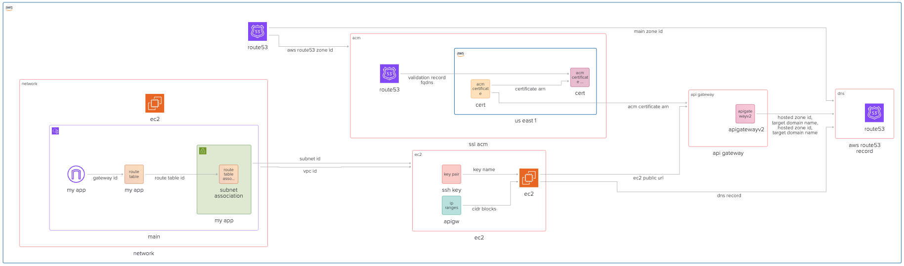

The architecture of our infrastructure is going to change a bit now, as we have to accommodate the API Gateway in between our Ec-2 and the DNS resolution. The overall architecture looks like this:

- Provision SSL certificate using ACM, for our API Gateway
- Provision API Gateway itself, and make it proxy requests to EC-2 instance
- Update Route53 to point our DNS to the Load Balancer
- Update EC-2 Instance to enable port 80, and update the security group with rule to accept incoming traffic only from API Gateway.

## Github Repository

This guide full code is available in https://github.com/Ship-Infra/ship-infra-project/tree/main/v5-api-gateway. Feel free to clone it and follow along!

## Provision SSL Certificate

You can follow the previous guide on [Provisioning SSL Certificate](./provision-ssl-certificate) to provision the SSL certificate using ACM. Ensure that you have the certificate ARN available for use in the API Gateway module.

## Provisioning AWS API Gateway

Now that we have network and SSL certificate, we can start provisioning the API Gateway itself.

### Creating API Gateway

First, let's create API Gateway resource:

```hcl
# modules/api-gateway/main.tf

resource "aws_apigatewayv2_api" "this" {
  name          = var.api_name
  protocol_type = "HTTP"
}
```

The above creates an API Container for a new API Gateway HTTP API (v2 is the newer version). We tell the API name an tell it that it is an HTTP API. It could be also web socket one if using `protocol_type = WEBSOCKET`.

### Creating Integration to Ec2

Now, we are going to define the integration between our ec2 and the new api gateway:

```hcl
# modules/api-gateway/main.tf

resource "aws_apigatewayv2_integration" "ec2" {
  api_id                 = aws_apigatewayv2_api.this.id
  integration_type       = "HTTP_PROXY"
  integration_uri        = var.ec2_public_url
  integration_method     = "ANY"
  payload_format_version = "1.0"
}
```

We define the both `uri`s above - the API Gateway and the EC-2 instance. `integration_type` tells that it is an HTTP Proxy meaning that all requests are forwarded into `integration_url` as is. `payload_format_version` is simply to ensure the request/response payload use HTTP/1.1 passthrough formatting.

Notice that `ec2_public_url` has to be a full URL like: `"http://<public-ec2-ip>:8080"`

### Integration Routes

Now that we have integration done, we need to specify when to activate it, i.e., on which request route. In our case it is all the requests should be routed to EC-2, so we need to say "whatever the request route/path, proxy it to ec2". Saying it in terraform language is like following:

```hcl
# modules/api-gateway/main.tf

resource "aws_apigatewayv2_route" "proxy" {
  api_id    = aws_apigatewayv2_api.this.id
  route_key = "ANY /{proxy+}"
  target    = "integrations/${aws_apigatewayv2_integration.ec2.id}"
}
```

The `ANY` - match all HTTP methods: `GET`, `POST`, `PUT`, etc., `/{proxy+}` is to match any pathname, and the `target` is naturally the target our ec2 integration.

### Adding Stage

API Gateways require definition of deployment and stage. Stages exist because API Gateway is designed for API lifecycle management. They allow us define environments like `dev` vs `prod`. Let's start coding it:

```hcl
# modules/api-gateway/main.tf

resource "aws_apigatewayv2_stage" "default" {
  api_id      = aws_apigatewayv2_api.this.id
  name        = "$default"
  auto_deploy = true
}
```

We will specify `$default` stage meaning we do not have production and dev environment, we only have 1 environment, since this is enough for our use case. Note, it bigger projects, we could have wanted multiple stages for better deployment strategies of API like separate environments (dev/staging/prod) but only a single API definition.

- https://api.example.com/dev/... → forwards to dev EC2
- https://api.example.com/prod/... → forwards to prod EC2

the `auto_deploy = true` means changes to routes/integrations are automatically deployed (no need for manual deploys).

### Custom Domain Mapping

Finally we have all the integration and rules in place, we are going to move a big higher in the picture and changing DNS and SSL to our Gateway API. It is pretty simple to do:

```hcl
# modules/api-gateway/main.tf

resource "aws_apigatewayv2_domain_name" "custom" {
  domain_name = var.domain_name

  domain_name_configuration {
    certificate_arn = var.acm_certificate_arn
    endpoint_type   = "REGIONAL"
    security_policy = "TLS_1_2"
  }
}
```

We simply specify the `domain_name` for DNS and the `certificate_arn` for SSL. `endpoint_type = "REGIONAL"` means that the API Gateway is deployed regionally and is not optimized for edge like for example in cloudfront. Finally we glue it all together in the mapping:

```hcl
resource "aws_apigatewayv2_api_mapping" "mapping" {
  api_id      = aws_apigatewayv2_api.this.id
  domain_name = aws_apigatewayv2_domain_name.custom.id
  stage       = aws_apigatewayv2_stage.default.id
}
```

Together, these ensure our API is available at https://api.example.com instead of the ugly default abcdef123.execute-api.us-east-1.amazonaws.com.

### Adding Route53 alias record

Finally, we want to make our DNS entry point at the custom domain in API Gateway:

```hcl
# modules/dns/main.tf
resource "aws_route53_record" "www" {
  zone_id = var.main_zone_id
  name    = var.domain_name
  type    = "A"
  alias {
    name                   = var.target_domain_name
    zone_id                = var.hosted_zone_id
    evaluate_target_health = false
  }
}
```

With new accepted variables:

```hcl
# modules/dns/variables.tf
variable "target_domain_name" { type = string }
variable "hosted_zone_id" { type = string }
```

And we will pass them from the outputs of API Gateway module. So first, let's define the outputs in `modules/api-gateway/outputs.tf`:

```hcl
# modules/api-gateway/outputs.tf

output "aws_apigatewayv2_domain_name" {
  value       = aws_apigatewayv2_domain_name.custom.domain_name_configuration[0].target_domain_name
  description = "The custom domain name for the API Gateway"
}

output "aws_apigatewayv2_hosted_zone_id" {
  value       = aws_apigatewayv2_domain_name.custom.domain_name_configuration[0].hosted_zone_id
  description = "The hosted zone ID for the API Gateway custom domain"
}
```

## Using it as a module

Now that we have defined all the moving pieces of the API Gateway module, we can use it in our terraform as follows:

```hcl
# main.tf
module "api_gateway" {
  source              = "./modules/api-gateway"
  api_name            = "my-api"
  domain_name         = "myapp.example.com"
  acm_certificate_arn = module.ssl_acm.aws_acm_certificate_arn
  ec2_public_url      = "http://${module.ec2.public_ip}:80"
}
```

## Updating Ec-2 firewall rules

We have added an API Gateway and told it that our ec2 is ready to listen on port 80. Next we need to update the firewall security groups of our ec-2 instance so that the port 80 is actually opened. Once it is opened, we will harden the rule by saying that it should accept connections only from our API Gateway. Let's update the Ec-2 security group. From [Deploying EC2 instance on AWS with Terraform](https://www.viktorvasylkovskyi.com/posts/provisioning-ec2-on-aws-with-terraform), our security group originally looks like this:

```hcl
resource "aws_security_group" "my_app" {
  vpc_id = aws_vpc.main.id

  ingress {
    cidr_blocks = [
      "0.0.0.0/0"
    ]
    from_port = 22
    to_port   = 22
    protocol  = "tcp"
  }

  egress {
    from_port   = 0
    to_port     = 0
    protocol    = "-1"
    cidr_blocks = ["0.0.0.0/0"]
  }
}
```

We will update it with port 80:

```hcl
resource "aws_security_group" "my_app" {
  name   = "SSH port for API"
  vpc_id = aws_vpc.main.id

  ingress {
    from_port   = 80
    to_port     = 80
    protocol    = "tcp"
    cidr_blocks = data.aws_ip_ranges.apigw.cidr_blocks
  }
}
```

And the `cird_blocks` are the IP ranges that are allowed for that security group, in our case inbound traffic for port 80. The `data.aws_ip_ranges.apigw.cidr_blocks` come from the official AWS public IP ranges JSON. It will not work just like that, we need to make terraform fetch this JSON by writing it down:

```hcl
data "aws_ip_ranges" "apigw" {
  services = ["API_GATEWAY"]  # Only API Gateway IPs
  regions  = ["us-east-1"]    # Your API Gateway region
}
```

We can also output them to see what IPs are those:

```hcl
output "apigw_ips" {
  value = data.aws_ip_ranges.apigw.cidr_blocks
}
```

## Testing

Now that we have all the code in place, I will let you glue the modules together. Once the code is ready, run `terraform init` and `terraform apply --auto-approve` and see that your infra is working now with the API Gateway!

## Destroying Infra

Remember, infra has costs. When you are done experimenting, you can destroy the infra like follows:

```bash
terraform destroy --auto-approve
```

## Conclusion

And that is a wrap! We have provisioned the setup that achieves the following:

- Users hit https://www.example.com
- DNS (Route 53) resolves to API Gateway
- API Gateway terminates SSL (using ACM cert)
- Routes any request → EC2 backend (via public IP).

This architecture is great for simple APIs that need SSL offloading without the overhead of load balancers or CDNs. API Gateway handles scaling, SSL, and routing, while EC2 runs your application logic. Continue experimenting and building and follow into the next article.
