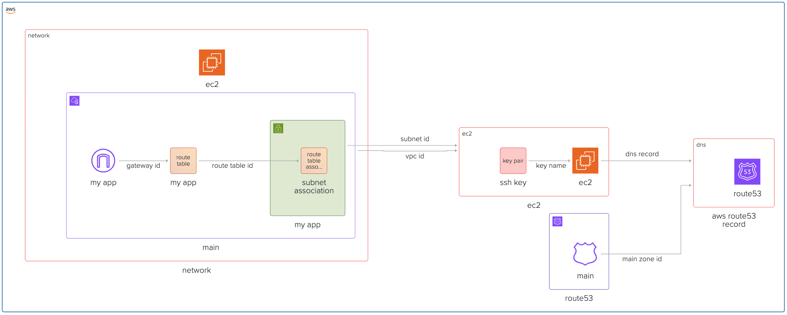

import { File, Folder, Files } from "fumadocs-ui/components/files";

In this notes, we are going to learn how to organise terraform code using best practices like terraform modules. For the sake of simplicity we will reduce the code to the very basic example. An interesting side-effect is by modularizing our code, we can easily create multiple environments like dev and prod, which we will see later.



## Github Repository

This guide full code is available in https://github.com/vvasylkovskyi/ship-infra-project/tree/main/v3-terraform-modules. Feel free to clone it and follow along!

## Creating Terraform Modules

Modularizing Terraform means splitting our infrastructure code into reusable, logical components called modules. This improves maintainability, reusability, and clarity, especially as our infrastructure grows.

The best practices are separation of concerns, using inputs and outputs for modules. There are `Root Module` and `Child Modules`, where root module is the directory where the terraform commands are meant to run, and child modules are the ones that contain reusable code.

We will create 3 modules: `network`, `ec2` and `dns`.

The overall folder structure should look like follows:

```files
.
├── modules/
│   ├── network
│   │   ├── main.tf
│   │   ├── variables.tf
│   │   └── outputs.tf
│   ├── ec2
│   │   ├── main.tf
│   │   ├── variables.tf
│   │   └── outputs.tf
│   ├── dns
│   │    ├── main.tf
│   │    ├── variables.tf
│   │    └── outputs.tf
├── main.tf
├── variables.tf
├── outputs.tf
└── terraform.tfvars
```

### Module: network

```hcl
resource "aws_vpc" "main" {
  cidr_block           = var.vpc_cidr
  enable_dns_hostnames = true
  enable_dns_support   = true
}

resource "aws_subnet" "my_app" {
  cidr_block        = var.subnet_cidr
  vpc_id            = aws_vpc.main.id
  availability_zone = var.availability_zone
}

resource "aws_internet_gateway" "my_app" {
  vpc_id = aws_vpc.main.id
}

resource "aws_route_table" "my_app" {
  vpc_id = aws_vpc.main.id

  route {
    cidr_block = "0.0.0.0/0"
    gateway_id = aws_internet_gateway.my_app.id
  }
}

resource "aws_route_table_association" "subnet-association" {
  subnet_id      = aws_subnet.my_app.id
  route_table_id = aws_route_table.my_app.id
}
```

**Variables:**

```hcl
# variables.tf

variable "vpc_cidr" { type = string }
variable "subnet_cidr" { type = string }
variable "availability_zone" { type = string }
```

**Outputs:**

```hcl
output "vpc_id" { value = aws_vpc.main.id }
output "subnet_id" { value = aws_subnet.my_app.id }
```

### Module: ec2

```hcl
resource "aws_security_group" "my_app" {
  name   = "Security Group for EC2 Instance"
  vpc_id = var.vpc_id

  ingress {
    cidr_blocks = ["0.0.0.0/0"]
    from_port   = 80
    to_port     = 80
    protocol    = "tcp"
  }


  ingress {
    cidr_blocks = ["0.0.0.0/0"]
    from_port   = 22
    to_port     = 22
    protocol    = "tcp"
  }

  egress {
    from_port   = 0
    to_port     = 0
    protocol    = "-1"
    cidr_blocks = ["0.0.0.0/0"]
  }
}

resource "aws_key_pair" "ssh-key" {
  key_name   = "ssh-key"
  public_key = var.ssh_public_key
}

resource "aws_instance" "my_app" {
  ami                         = var.instance_ami
  instance_type               = var.instance_type
  availability_zone           = var.availability_zone
  security_groups             = [aws_security_group.my_app.id]
  associate_public_ip_address = true
  subnet_id                   = var.subnet_id
  key_name                    = aws_key_pair.ssh-key.key_name
}

resource "aws_eip" "my_app" {
  instance = aws_instance.my_app.id
  domain   = "vpc"
}
```

We will also add security group next to our EC2 module to allow SSH and HTTP access.

**Variables:**

```hcl
# variables.tf

variable "instance_ami" { type = string }
variable "instance_type" { type = string }
variable "availability_zone" { type = string }
variable "subnet_id" { type = string }
variable "ssh_public_key" { type = string }
variable "vpc_id" { type = string }
```

**Outputs:**

```hcl
output "instance_id" { value = aws_instance.my_app.id }
output "public_ip"   { value = aws_eip.my_app.public_ip }
```

### Using modules - route module

The root modules will reference the children modules and assign the variables.

```hcl
# main.tf

provider "aws" {
  region                   = "us-east-1"
  shared_credentials_files = ["./.aws-credentials"]
  profile                  = "terraform"
}

module "network" {
  source            = "./modules/network"
  vpc_cidr          = "10.0.0.0/16"
  subnet_cidr       = "10.0.1.0/24"
  availability_zone = var.availability_zone
}

module "security_group" {
  source = "./modules/security_group"
  vpc_id = module.network.vpc_id
}

module "ec2" {
  source            = "./modules/ec2"
  instance_ami      = var.instance_ami
  instance_type     = var.instance_type
  availability_zone = var.availability_zone
  subnet_id         = module.network.subnet_id
  ssh_public_key    = var.ssh_public_key
}
```

And the outputs:

```hcl
# outputs.tf

output "ec2_ip_address" {
  value       = module.ec2.public_ip
  description = "The Elastic IP address allocated to the EC2 instance."
}
```

## Install modules and apply

The modules have to be installed, so we need to run `terraform init` first. After that run `terraform apply --auto-approve` to see that everything works ok. You should see something like this on terminal:

```sh

Apply complete! Resources: 3 added, 0 changed, 0 destroyed.

Outputs:
ec2_ip_address = "your-ip"
```

## Adding DNS module pointing to our instance and a simple HTTP server

Now to make things interesting, we will create a simple web server and two environments - dev and prod. A common requirement for web applications.

To accomplish that, we need to create:

- DNS module
- Update EC-2 Module to launch HTTP server
- Make dev and prod environments

### DNS Module

Similarly, we will create the `module` called `dns` with 3 files in it - main, variables, outputs.

```hcl
# main.tf
resource "aws_route53_record" "www" {
  zone_id = var.main_zone_id
  name    = var.domain_name
  type    = "A"
  ttl     = 60
  records = [var.dns_record]
}

```

Variables:

```hcl
# variables.tf

variable "main_zone_id" { type = string }
variable "domain_name" { type = string }
variable "dns_record" { type = string }
```

```hcl
# outputs.tf
output "dns_record" {
  value       = aws_route53_record.www.fqdn
  description = "The FQDN of the www Route53 record"
}
```

We will leave `outputs.tf` black for now.

Now in our `route53.tf`:

```hcl
# route53.tf

resource "aws_route53_zone" "main" {
  name = "viktorvasylkovskyi.com"
}

module "aws_route53_record" {
  source       = "./modules/dns"
  domain_name  = var.domain_name
  main_zone_id = aws_route53_zone.main.zone_id
  dns_record   = module.ec2.public_ip
}
```

Note, the `domain_name` is your domain name that you should own. Declare this variable in your `variables.tf` in the root module, and define it in `terraform.tfvars`.

### Updating our EC-2 to start HTTP server

Now, let's update our `ec2` module in `main.tf`. We are going to add a `user_data` that will instantiate a simple http server on the startup of the machine. Add the following:

```hcl
# ec2.main.tf

resource "aws_instance" "app" {
  ... your instance previous code ...
  user_data = <<-EOF
              #!/bin/bash
              sudo yum update -y || sudo apt-get update -y
              sudo yum install -y python3 || sudo apt-get install -y python3
              echo "<html><body><h1>Hello from Terraform EC2!</h1></body></html>" > index.html
              nohup python3 -m http.server 80 &
              EOF
}
```

### Adding outputs

Add outputs at the root module:

```hcl
# outputs.tf

output "ec2_domain_name" {
  value       = module.aws_route53_record.dns_record
  description = "The Elastic IP address allocated to the EC2 instance."
}
```

### Apply changes

Run `terraform init` and `terraform apply --auto-approve` and see your server working. You should be able to open browser at `var.domain_name`.

## Destroying Infra

Remember, infra has costs. When you are done experimenting, you can destroy the infra like follows:

```bash
terraform destroy --auto-approve
```

## Conclusion

By modularizing our Terraform code, we make our infrastructure more organized, reusable, and easier to maintain. This approach not only saves time as our projects grow, but also helps us avoid duplication and mistakes. With modules, scaling and evolving your infrastructure becomes a much smoother process.
Next we are going to focus on security, and more importantly, the SSL termination for our web applications.

## Appendix

(Note, the following is optional. The following guides assume you do not follow this in the code, for simplicity sake.)

## Adding dev and production environments

The great thing about modules is that we can reuse them. Let's reuse them in two environments: prod and dev. We need to refactor our code such that we have new folder structure:

```sh
environments/
  dev/
    main.tf
    terraform.tfvars
    variables.tf
  prod/
    main.tf
    terraform.tfvars
    variables.tf
modules/
```

Note, since our environments will be pretty much the same, the `terraform.tfvars` are going to drive the change of the environments.

Example of the `terraform.tfvars` in `dev`

```hcl
availability_zone = "us-east-1a"
instance_ami      = "ami-xxxx"
instance_type     = "t2.micro"
domain_name       = "dev.example.com"
```

and in `prod`

```hcl
availability_zone = "us-east-1b"
instance_ami      = "ami-yyyy"
instance_type     = "t3.medium"
domain_name       = "prod.example.com"
```

Now, you can apply.

## Applying multiple environments

You can apply both environments using `terraform apply`. Just jump into the folder and run apply.
