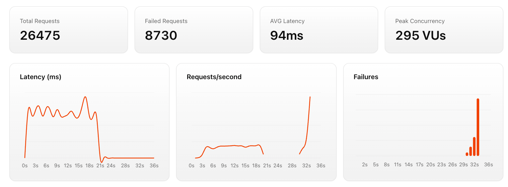

It would not be a complete infrastructure setup without some load testing. We have built this beautiful infrastructure that does pretty much nothing. But how much user load can it handle? Let's find out!

### Using k6 for Load Testing

We are going to use [k6](https://k6.io/) - a modern load testing tool that makes it easy to script and run load tests. First, install k6 by following the instructions on their [installation page](https://grafana.com/docs/k6/latest/set-up/install-k6/).

### Writing a Load Test Script

We are going to create a simple load test script that hits our web application's domain. Create a file named `load-test.js` with the following content:

We are going to simulate 10000 virtual users (VUs) over a period of 20 seconds, sending requests to our web application's domain.

The following is the script content that you should put in `load-test.js`:

```javascript
import http from 'k6/http';
import { sleep } from 'k6';
export const options = {
  vus: 10000,
  duration: '20s',
};
export default function () {
  http.get('http://www.your-domain.com');
  sleep(1);
}
```

### Running the Load Test

You can run the load test using the following command:

```bash
k6 run load-test.js
```

The test will start, after it finishes, the `json` file will be created and you will see real-time statistics about the requests being made, response times, and any errors encountered.

### Analyzing the Results

The JSON output file can be analyzed using various tools. One popular option is to use [Grafana](https://grafana.com/) along with [k6 Cloud](https://k6.io/docs/cloud/). You can also use the built-in summary report that k6 provides at the end of the test run.

I have made a simple web app to render the results, and here is a sample screenshot of how the results might look:



You can see that our infrastructure did not handle the 10000 users very well! Outch!

This is expected since we did not setup auto-scaling, or caching, and only had two EC2 instances running. In a production scenario, you would want to implement these features to handle high traffic loads effectively.
