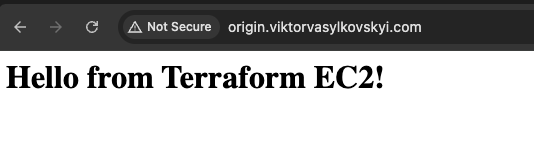
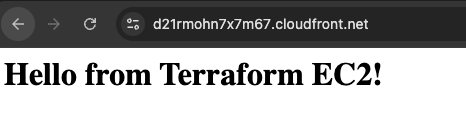

Previously we have seen how to setup an EC-2 instance, run a simple web server and expose it at your domain using Route53. This allows us to access our web server using HTTP at port 80. If you haven't read about it, please refer to the previous notes:

- [Deploying EC2 instance on AWS with Terraform](../core-web-app/provisioning-ec2-on-aws-with-terraform)
- [Provision DNS records with Terraform](../core-web-app/provisioning-dns-records-with-terraform)

The natural next step in that setup is to use HTTPS (HTTP + SSL) and enforce access at port 443 instead. We will do it here by adding Cloudfront and ACM to our terraform setup. Let's dive in.

## Adding Cloudfront distribution

I will confess that it is not super easy to add CloudFront + ACM for HTTPS for a beginner, so I will break down the steps from simplest cloud architecture to most complicated one hopefully clarifying the steps and the reason for taking them.

First step to add an HTTPS using Cloudfront is naturally to create a Cloudfront distribution. Cloudfront distribution is a CDN network that expands copies of your data towards other geographical locations. From the programmer point of view, Cloudfront is a URL - the distribution URL that uses the content from the `origin`. Hence these are the two fundamental pieces that we need for now to make sure the distribution works. So let's dive in.

### Adding Cloudfront - Creating Origin Server

First thing is to define our origin endpoint. We can do it using Route53, where the origin is a URL pointing to our Ec-2 instance. Let's do it

```tf
# modules/dns/main.tf

resource "aws_route53_zone" "main" {
  name = "viktorvasylkovskyi.com"
}

resource "aws_route53_record" "origin" {
  zone_id = var.main_zone_id
  name    = var.domain_name
  type    = "A"
  ttl     = 300
  records = [var.origin_ip]
}
```

Make sure to add the variables in `variables.tf`:

```tf
# modules/dns/variables.tf
variable "main_zone_id" { type = string }
variable "domain_name" { type = string }
variable "origin_ip" { type = string }
```

And the origin_ip is going to be the public IP of our Ec-2 instance. So in the main `tf` file we need to update the module call:

```tf
# main.tf
module "dns" {
  source        = "./modules/dns"
  domain_name   = "origin.your-domain.com"
  main_zone_id  = aws_route53_zone.main.zone_id
  origin_ip     = module.ec2.public_ip
}
```

And let's make sure to output the FQDN of our origin:

```tf
# modules/dns/outputs.tf
output "origin_dns_record" {
  value       = aws_route53_record.origin.fqdn
  description = "The FQDN of the origin Route53 record"
}
```

You can test now by running `terraform apply`. Note, this `origin.your-domain.com` is going to be available on HTTP now.



### Adding Cloudfront - Define Distribution

Now that we have an origin, we can create distribution:

```tf
# modules/cloudfront/main.tf

resource "aws_cloudfront_distribution" "cdn" {
  enabled             = true
  default_root_object = "index.html"
  origin {
    domain_name = var.aws_route53_origin_fqdn
    origin_id   = var.aws_route53_origin_fqdn
    custom_origin_config {
      http_port              = 80
      https_port             = 443
      origin_protocol_policy = "http-only"
      origin_ssl_protocols   = ["TLSv1.2"]
    }
  }
  default_cache_behavior {
    allowed_methods  = ["GET", "HEAD"]
    cached_methods   = ["GET", "HEAD"]
    target_origin_id = var.aws_route53_origin_fqdn
    forwarded_values {
      query_string = false
      cookies {
        forward = "none"
      }
    }
    viewer_protocol_policy = "redirect-to-https"
    min_ttl                = 0
    default_ttl            = 3600
    max_ttl                = 86400
  }
  price_class = "PriceClass_100"
  viewer_certificate {
    cloudfront_default_certificate = true
  }
  restrictions {
    geo_restriction {
      restriction_type = "none"
    }
  }
}
```

Whoa! that is a lot of configs. One of the main pieces there is the `target_origin_id`. This will be pointing to our `origin.your-domain.com`. For now we will use `cloudfront_default_certificate` which is CloudFront certificate.

Let's add a variable and test output:

```tf
# modules/cloudfront/variables.tf
variable "aws_route53_origin_fqdn" { type = string }
```

And output:

```tf
# modules/cloudfront/outputs.tf

output "cloudfront_distribution_domain_name" {
  value = aws_cloudfront_distribution.cdn.domain_name
}
```

Also, if you followed through previous article on setting up the API Gateway, then make sure to remove the API Gateway related code from the `main.tf` and `variables.tf` files as we are not using it here. Additionally, ensure that you have the security group allowing HTTP from anywhere:

```tf
# modules/security_group/main.tf
resource "aws_security_group" "my_app" {
  name   = "Security Group for API"
  vpc_id = var.vpc_id

  ingress {
    cidr_blocks = ["0.0.0.0/0"]
    from_port   = 80
    to_port     = 80
    protocol    = "tcp"
  }

... rest of the code ...
}
```

Finally, update the `main.tf` file to pass the origin FQDN to CloudFront module:

```tf
# main.tf

module "cloudfront" {
  source                     = "./modules/cloudfront"
  aws_route53_origin_fqdn    = module.dns.origin_dns_record
}
```

Also, ensure that we have outputs for CloudFront distribution domain name:

```tf
# outputs.tf
output "cloudfront_distribution_domain_name" {
  value = aws_cloudfront_distribution.cdn.domain_name
}

output "cloudfront_distribution_hosted_zone_id" {
  value = aws_cloudfront_distribution.cdn.hosted_zone_id
}
```

## Apply changes

Install the new module with `terraform init` and then run `terraform apply` and observe the `cloudfront_distribution_domain_name` output. It should return something like

```sh
d123456789abcdef.cloudfront.net. # example URL
```

If everything went well then you should be able to open the URL in the browser. (Notice the URL in browser)



## Provision SSL Certificate

You can follow the previous guide on [Provisioning SSL Certificate](./provision-ssl-certificate) to provision the SSL certificate using ACM. Ensure that you have the certificate ARN available for use in the API Gateway module.

### Adding CloudFront Distribution

In the next step we are going to create a cloudfront distribution which contains an endpoint with HTTPS termination and is a place where we are going to place our SSL certificate. First we need to set a rule to wait for the certificate to be validated before creating the distribution.

```tf
# modules/cloudfront/main.tf

resource "aws_cloudfront_distribution" "cdn" {
  depends_on = [var.acm_certificate]
}
```

Ensure to add a variable for it:

```tf
# modules/cloudfront/variables.tf
variable "acm_certificate" { type = string }
```

And bring this certificate from the `main.tf` file, from ssl module:

```tf
# main.tf

module "ssl_acm" {
  source              = "./modules/acm"
  aws_route53_zone_id = aws_route53_zone.main.zone_id
}

module "cloudfront_cdn" {
  source                    = "./modules/cloudfront"
  aws_route53_origin_fqdn   = module.aws_route53_record.origin_dns_record
  acm_certificate           = module.ssl_acm.aws_acm_certificate_arn
}
```

### Use SSL Certificate in CloudFront

We can now change the **Viewer certificate:** on CloudFront to use our validated ACM certificate for https://www.your-domain.com.

```tf
# modules/cloudfront/main.tf

resource "aws_cloudfront_distribution" "cdn" {
  depends_on = [var.acm_certificate]
  ... other code ...
  viewer_certificate {
    acm_certificate_arn      = aws_acm_certificate.cert.arn
    ssl_support_method       = "sni-only"
    minimum_protocol_version = "TLSv1.2_2021"
  }
  ... other code ...
}
```

### Route 53 Record Pointing to CloudFront

Now that Cloudfront setup is done, it is going to be available between our ec2 instance and our DNS. So now we have the Cloudfront doing SSL and sending requests to the ec2 instance. The last step is to enable our DNS Route 53 to send.

```tf
# modules/dns/main.tf
resource "aws_route53_record" "origin" {
  zone_id = var.main_zone_id
  name    = "origin.viktorvasylkovskyi.com"
  type    = "A"
  ttl     = 300
  records = [var.origin_ip]
}

resource "aws_route53_record" "www" {
  zone_id = var.main_zone_id
  name    = "www.viktorvasylkovskyi.com"
  type    = "A"
  alias {
    name                   = var.target_domain_name
    zone_id                = var.hosted_zone_id
    evaluate_target_health = false
  }
}
```

And make sure to use the correct variables:

```tf
# modules/dns/variables.tf
variable "main_zone_id" { type = string }
variable "target_domain_name" { type = string }
variable "hosted_zone_id" { type = string }
variable "origin_ip" { type = string }
```

This sets an alias A record in Route 53 so your domain `www.your-domain.com` points to the CloudFront distribution instead of the EC2 directly.

Finally, let's glue it all together in the `main.tf`:

```tf
# main.tf
resource "aws_route53_zone" "main" {
  name = "your-domain.com"
}

module "ssl_acm" {
  source              = "./modules/acm"
  aws_route53_zone_id = aws_route53_zone.main.zone_id
}

module "cloudfront_cdn" {
  source                    = "./modules/cloudfront"
  aws_route53_origin_fqdn   = module.aws_route53_record.origin_dns_record
  acm_certificate           = module.ssl_acm.aws_acm_certificate_arn
}

module "aws_route53_record" {
  source       = "./modules/dns"
  main_zone_id = aws_route53_zone.main.zone_id
  origin_ip = module.ec2.public_ip
  target_domain_name = module.cloudfront_cdn.cloudfront_distribution_domain_name
  hosted_zone_id = module.cloudfront_cdn.cloudfront_distribution_hosted_zone_id
}
```

Lastly, let's not forget to expose port 443 in our VPC security group:

```tf
# security_group.tf

resource "aws_security_group" "my-app" {
  name   = "SSH Port"
  vpc_id = aws_vpc.main.id

  ...

  ingress {
    cidr_blocks = [
      "0.0.0.0/0"
    ]
    from_port = 443
    to_port   = 443
    protocol  = "tcp"
  }

  ...
}
```

### Output

Finally, let's add some output for debugging:

```tf
# output.tf

output "https_url" {
  value       = "https://www.your-domain.com"
  description = "Public HTTPS endpoint for the EC2 app."
}
```

All should be working now, lets try to provision our new infrastructure. Run: `terraform apply --auto-approve`.

## Final Validations

You should be able to open your app using `https://www.your-domain.com`. However if it is not working, we can troubleshoot:

### Check DNS propagation

Run:

```sh
dig www.your-domain.com +short
```

If it still returns an IP address, it means the A record is pointing directly to EC2 and not CloudFront — which won't support HTTPS directly.

## Destroying Infra

Remember, infra has costs. When you are done experimenting, you can destroy the infra like follows:

```bash
terraform destroy --auto-approve
```

## Conclusion

We have covered quite a bit of things today:

- SSL certificate via ACM
- HTTPS access via CloudFront
- DNS validation using Route 53
- A secure, CDN-backed endpoint for your EC2 app at https://www.your-domain.com

At this point you are well equipped to set you application in production as you now have HTTPS and a Ec-2 instance and can access to it via your domain name. Next, lets explore how to setup Application Load Balancer in front of our EC-2 instance. Continue reading the [Provision Application Load Balancer with Terraform](./provisioning-alb-as-ssl-termination-and-ec2).
